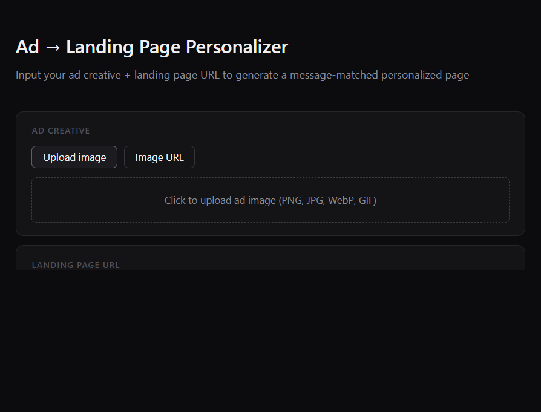
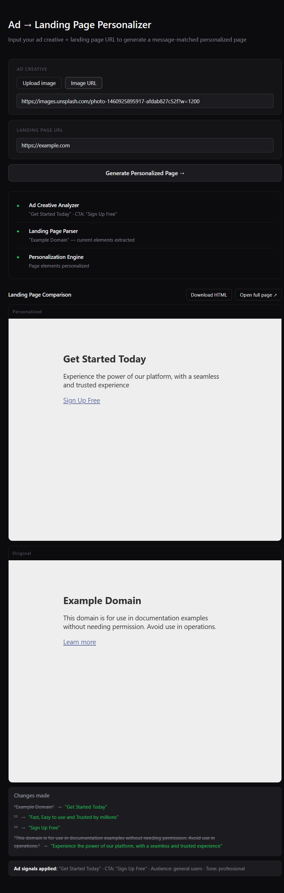

# Ad -> Landing Page Personalizer

Troopod AI PM Assignment

Turn ad clicks into message-matched landing pages in one run.

This project takes an ad creative plus a landing page URL and returns a personalized version of that page where headline, CTA, and value prop align with the ad promise.

## Screenshots

### Home screen

### Personalized output (before vs after)

## How it works

### Agent 1: Ad Creative Analyzer

- Input: ad image upload or ad image URL
- Model: Groq with `meta-llama/llama-4-scout-17b-16e-instruct`
- Output: strict JSON fields (headline, subheadline, CTA, value proposition, audience, tone, language mix, colors, benefits, badges, disclaimer, urgency)
- Reliability: `safeAnalysis` defaults ensure malformed/null fields are normalized before downstream usage

### Agent 2: Landing Page Parser + Design Extractor

- Fetches target page server-side via API route to avoid browser CORS issues
- Returns both raw HTML and extracted text summary
- Parses raw HTML DOM to extract current page elements (h1, h2, CTA, hero paragraph)
- Captures live screenshot through Microlink and extracts page design system (brand colors, font style, layout, CTA style, tone)

### Agent 3: Personalization Engine

- Static/SSR pages: returns a constrained JSON diff, then applies targeted DOM edits (headline, subheadline, CTA, value prop) and injects brand color variables
- SPA pages: if both h1 and h2 are empty after extraction, switches to generation mode and creates a brand-matched Tailwind HTML page using extracted design-system cues

## Why this is useful

- Fixes message mismatch between ad copy and landing page copy
- Preserves original brand feel for static pages via surgical edits
- Handles modern SPA pages with a design-system aware fallback
- Gives a clear side-by-side before/after preview for fast review

## Guardrails

- Strict JSON formats in analysis and diff steps reduce drift
- Server-side API key handling keeps secrets out of the browser
- Preview sanitization strips unsafe scripts/CSP/preload noise and injects base URL for cleaner rendering
- SPA branch and static branch are intentionally separated for predictable behavior

## Tech Stack

- Next.js 14 + React 18
- Groq API (`meta-llama/llama-4-scout-17b-16e-instruct`) for all model calls
- Microlink for screenshot capture
- Stateless flow (no database)

## Deploy on Vercel

1. Push this repository to GitHub.
2. Import it in Vercel: https://vercel.com/new
3. Add environment variable:
   - Key: `GROQ_API_KEY`
   - Value: your Groq key
4. Deploy.

## Notes

- API route name is still `/api/claude` for backward compatibility, but it routes to Groq.
